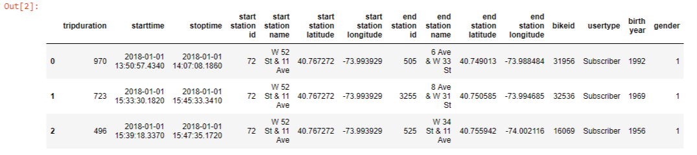

# NYC_Bike_Tableau

The objective was to visualize data from the NYC citi-bike program in Tableau.

After tinkering with some of the smaller data sets avaiable (i.e. 15,000 rows each), it was time to create an effecient loop that could process 12 months of the full data set.

The raw data required some cleaning; i.e. the age of the rider would be more useful than the year they were born; converting gender classifications from numerical to strings, etc.

The full data set had a seperate CVS file for each month and averaged over 1 million rows of data!
Rather than having to manully take each month through the cleaning process, the Jupyter Notebook program was designed to load, read, clean, and save each raw CSV file into a new Clean CSV file.
All 12 of the clean CSV files were then combined into a single CSV file with 17

The final CSV file was sucessfully loaded into the free version of Tableau and I was able to make numerous visuals to explore the data.

What I didn't realize at the time was that Tableau Public has a limit, they will only allow files with less than 15 mm rows of data to be loaded.
The master CSV file with all 12 months of raw data had 17,548,339...

